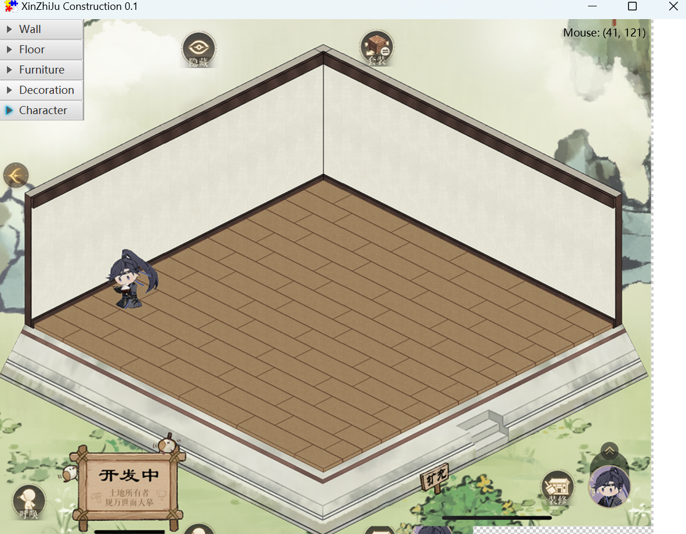

# About this project
This is a simple building game designed for lovers of Ashes of the kingdom (Code: Kite) to create their dreamed rooms without limitations.

It's written in Java with JavaFX and FXGL. Build with maven. It's planned to be hosted on website with JPRO so it can be run on any devices without Java plugin.

Website to download: https://xinzhiju.replit.app/
Have fun!!

## TODO
- [x] Set up project
- [x] Add background, side pane
- [x] Implement item placement and removal
- [x] Change the background image to cleaner one
- [x] Replace items with images
- [x] Implement item rotation
- [ ] Implement view setting
- [x] Better UI with CSS
- [ ] Implement screenshot functionality
- [ ] Host on website with JPro
- [ ] Implement backend on server side

## ScreenShot

